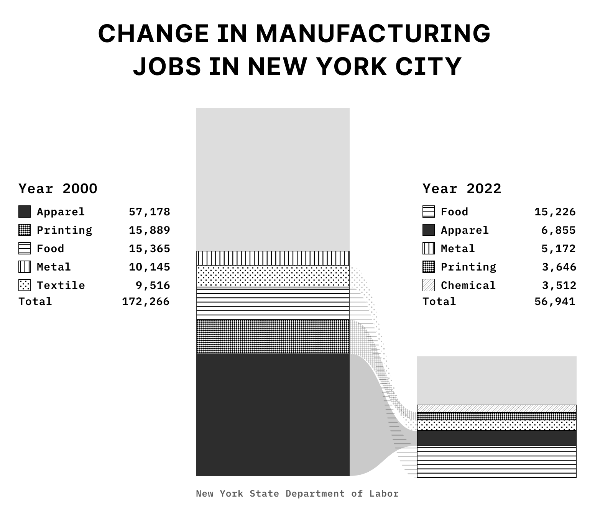

# Interworven
 The evolution of New York City's Garment District

The Garment District is one of the most significant shifts in the history of American urban planning and New York City's economy and cultural influence. Much like the pioneering strides made by the automobile and steel industries, this remarkable enclave of highly specialized expertise thrived on the benefits of proximity, fostering the seamless exchange of resources, labor, and invaluable information. 

Spanning eight blocks in the heart of Manhattan, the district boasts a skilled workforce comprising sewing machine operators, pattern makers, knitters, weavers, fabric sellers, button makers, and seamstresses. Together, they made New York City a global powerhouse in apparel manufacturing.

During its heyday, the Garment District functioned as a highly efficient economic system that employed over a third of the city's manufacturing workers and constituted a substantial portion of its total workforce. Notably, women and immigrants have played a pivotal role in the history of the Garment district.

The industry has experienced a decline in recent years due to the availability of cheaper labor overseas. Despite these challenges, the Garment District retains certain advantages that contribute to its resilience. The district's proximity to fashion designers, showrooms, and suppliers, as well as its strong network of skilled workers, fosters collaboration, innovation, and quick turnaround times.

Between 1958 and 1977, garment manufacturing in Manhattan was cut in half, a trend that would continue throughout the 1980s and 1990s. Instead of supporting the dwindling manufacturing sector, the Mayor's office chose to invest in the growing service sector, reshaping the character of the neighborhood.
In 2000, apparel manufacturing accounted for 33.2 percent of all manufacturing jobs in the city, and food manufacturing accounted for 8.9 percent. In 2022, food accounts for 26.7 percent, and apparel accounts for 12.0 percent.

At its peak in 1947, more than a million New Yorkers worked in factories. That number began to decrease by 1996, the city had only 72,000 workers in the apparel industry overall. In 2000, apparel manufacturing accounted for 33.2 percent of all manufacturing jobs in the city and food manufacturing accounted for 8.9 percent. In 2014, food accounted for 21.6 percent and apparel 20.7 percent.

The Garment District has been synonymous with design since its inception in 1919, and today it is still the living center of American fashion design, home to the greatest concentration of fashion designers in the country.But beneath the gloss of fashion lies a rich history of the people who gave life to this colorful and enduring New York neighborhood.
